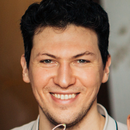
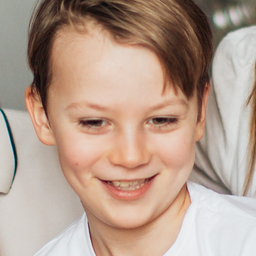
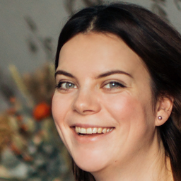
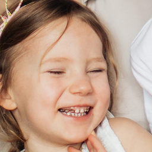

# Collecting face images from images

## Installation
from collecting_faces.collect_faces import collect_faces

pip install collecting_faces==1.0.5

## Requirements

- dlib
- numpy
- opencv-python
- Pillow
- scipy
- tqdm

## Example
### **collect_faces(raw_dir, aligned_dir, output_size=256)**

:: Extracts 256x256 faces from raw_dir containing original images

- Before

- After

* Align function is from FFHQ dataset pre-processing step

- https://github.com/NVlabs/ffhq-dataset/blob/master/download_ffhq.py
